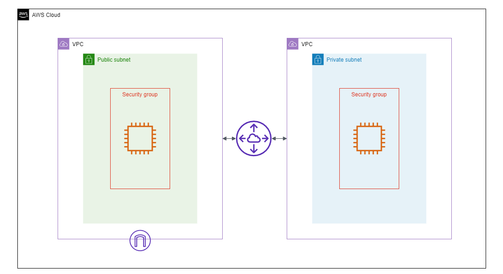

# VPC Peering with Terraform
**This project is created to make practices with Terraform.**
In this project, these resources are created:
- 2 VPC in **different regions** (Frankfurt, which is main region and Stockholm)
- One subnet for **each** VPC (Frankfurt is public and Stockholm is private)
- One route table for **each** VPC
- One internet gateway for **main** VPC
- Peering Connection
- One EC2 instance for **each** subnet
- One security group for **each** EC2 instance

**You can edit the `variables.tf` file to configure the infrastructure.**